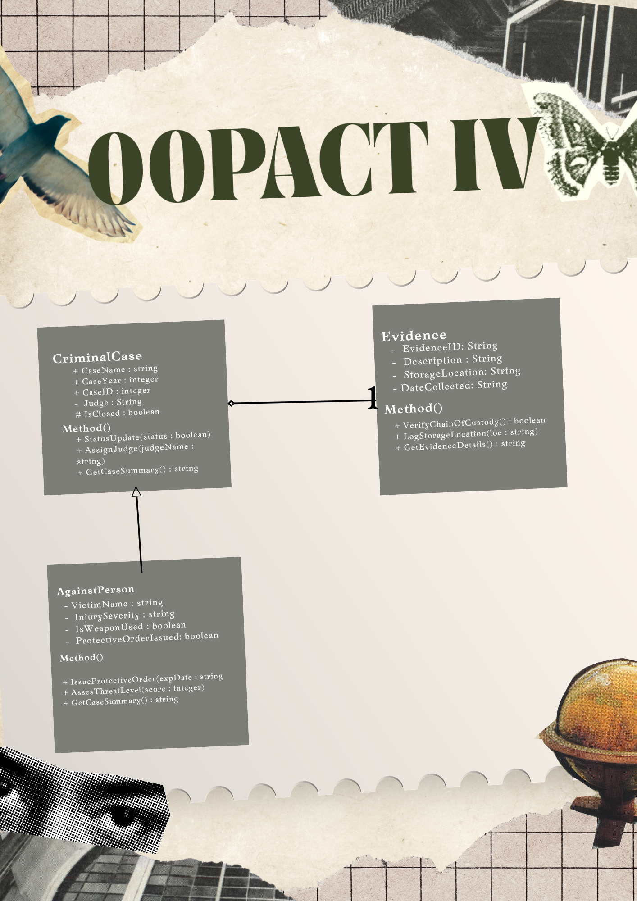
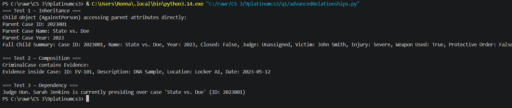

# Advanced Class Relationships

## Previous Activities

[classAttrib](classAttributesMethods.md)

[classRel](classRelationships.md)

## Existing System Description: 
Class 1: CriminalCases

Class 2: DefendantVerdict 

Problems and Limitations: The main problems with the current system design are the attribute redundancy, method duplication, inappropriate entity modeling, and lack of separation of concerns. The two classes, CriminalCases and DefendantVerdict, inefficiently store CaseName as an attribute and have the same methods of retrieving case summary information, GetCaseSummary() and caseSummary(). Moreover, the DefendantVerdict class is used to define a temporary judicial action or event outcome as an entity and confuses the case’s attributes, verdict flags, and text details. And most importantly, a problem I should've noticed when reading the instructions that I cant use my class DefendantVerdict because I cant use a HAS-A(aka assosciation relationship) so I plan to change my child class to AgainstPerson. 

## Inhertinace Relationship

Parent: CriminalCases

Child: AgainstPerson

Explanation: CriminalCases is a broader term, in which there are multiple types of it. One being Crimes against a person. To simplify, AgainstPerson is a type of CriminalCase that can be done.  

## Inheritance UML

## Composition/Aggregation

Relationship: Composition

Explanation: CriminalCase has a strong composition (HAS-A) relationship with Evidence as an evidence record cannot exist on its own in the system.

## Advanced UML Diagram

 

## Python Implementation

[Source Code](advancedRelationships.py)

## Test Run

 

## Object Diagram

## Reflection

1. Why did you choose your inheritance relationship?

I chose to make AgainstPerson a subclass to CriminalCase since the former is a special case of the latter. In other words, there is a need to follow the IS-A rule for the inheritance relationship. In which the child class shares common criminal case features with a parent but also has its own specific aspects.

2. How did inheritance reduce duplicate code?

Using the inheritance allowed me to avoid writing additional code because I could use the already existing class attributes and methods. For example, I did not need to write extra code for the case name, year, ID, or whether the case is closed because these parameters are available in the CriminalCase parent class. Therefore, it is possible to see how using the parent class reduced the number of cases to write.

3. Why is your HAS-A relationship Composition or Aggregation?

My HAS-A relationship is better characterized by a composition because the evidence in a criminal case is meant to exist only when a specific case is open. Basically, the Evidence object is created when a CriminalCase is initialize. And when the latter gets deleted it will delete the Evidence instance too because it does not have an independent existence.

4. What is the difference between Association and the advanced relationship implemented?

The association relationship type is more of a casual connection where two objects are using each other’s features but are not codependent on each other to exist. For example, the Judge class is associated with CriminalCase because the former uses the latter to hear a witness but does not depend on it. The implemented advanced relationship is different because it implies that one object (CriminalCase) owns another (Evidence) and controls its lifecycle.

5. How does your design follow the DRY principle?
   
The design follows the Don’t Repeat Yourself, or DRY, principle because there is a single source of truth for everything involved. For example, it was enough to write the CriminalCase class with common attributes and methods, and it was possible to use its parts in the child class without repeating the code. Another example is that I used the parent class’s GetCaseSummary method instead of repeating the code for writing a string.
