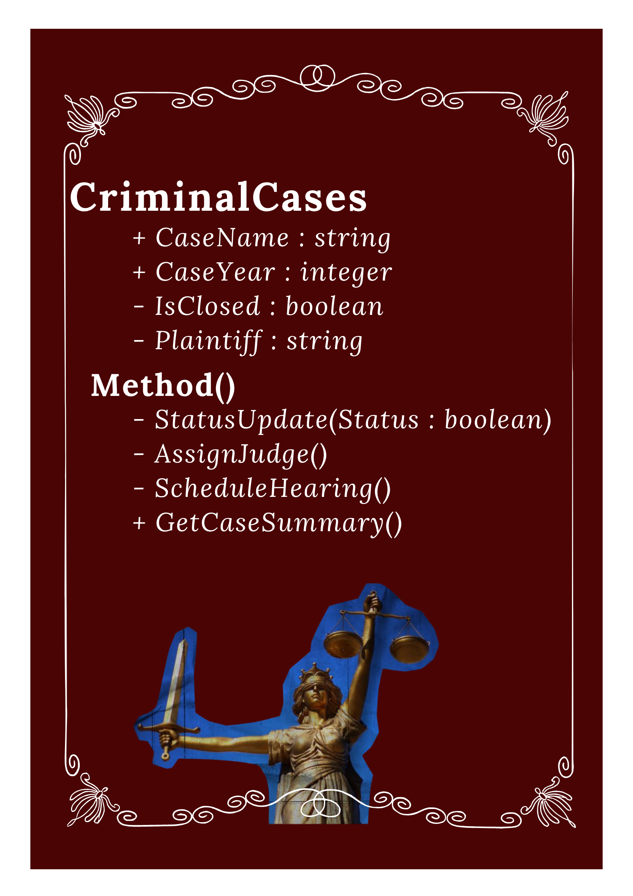
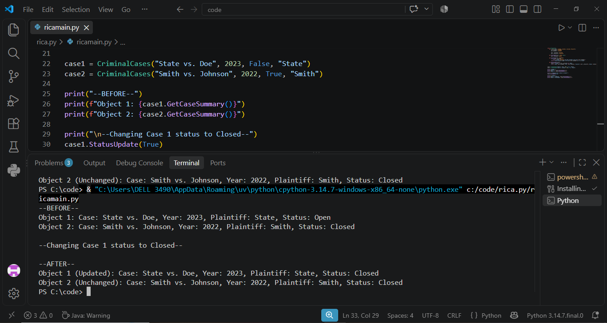

# Class Attributes and Methods
## Previous Design

Link to my previous activity:
[classObjectUML.md](classObjectUML.md)

## Design Revision
No major changes were needed from my original design.

## Visibility Decisions
| Attribute | Data Type | Visibility | Reason |
|---|---|---|---|
| CaseName | String | Public | General identification |
| CaseYear | Integer | Public | Further identification and precision |
| IsClosed | Boolean | Private | To prevent illegal tampering |
| Plaintiff | String | Private  | To protect identity and to remain protected from unauthorized edit |

## Updated UML Class Diagram

## Python Implementation
[View Python Source](classImplementation.py)

## Test Run

## Object Diagram

## Analysis
### Why did you make your chosen attribute private?
### Which method changes the state of your object?
### How did your two objects demonstrate that instances are independent?
### What is the difference between your class diagram and your object diagram?
