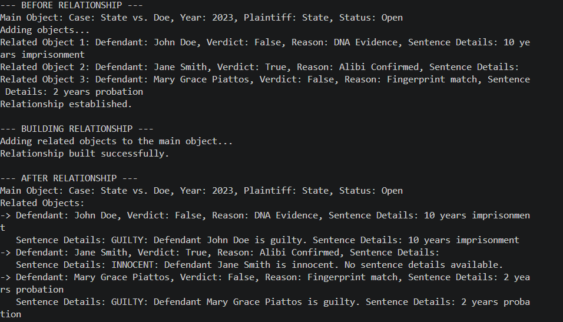
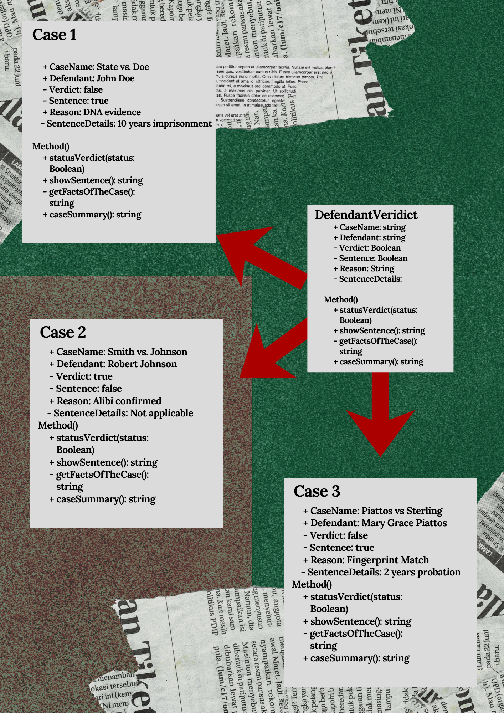

# Class Relationships: Association and Multiplicity

## Previous Work
[Part I - Classes and Objects](classObjectUML.md)

[Part II - Class Attributes and Methods](classAttributesMethods.md)

## Existing Class
Class: CriminalCases

Description: The CriminalCase class represents an individual criminal court case within a legal management system. It manages essential case information and controls operational workflows based on whether the case is active or closed.

## New Related Class
Class: DefendantVerdict

Description: DefendantVerdict class shows the verdict of the defendant of the CriminalCase and a short summary of what happened during the case, which includes the facts of the case, the defendant, the defendants accused crime.

## Association
Relationship: CriminalCases contains entire scope of a case, while DefendantVerdict is assigned to defendant focused. 

Explanation: DefendantVerdict is the defendant-focused view of the case and also is a direct continuation of the case while CriminalCases is just the broad summary of the case.

## Multiplicity
Multiplicity: One-to-Many

Explanation: Because the one object from CriminalCases, CaseSummary, is the broader and more summarized term while multiple objects in DefendantVerdict explain the case in more detail. 

## UML Class Relationship Diagram

## Python Implementation
[View Python Source](classRelationships.py)

## Test Run

## Object Relationship Diagram

## Analysis
### What is the association between your two classes?
### What multiplicity did you choose and why?
### How did you implement the relationship in Python?
### Why did you store an object reference instead of copying its data?
### If your relationship uses many, why is a list appropriate?
